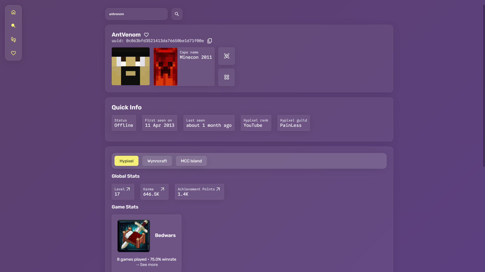
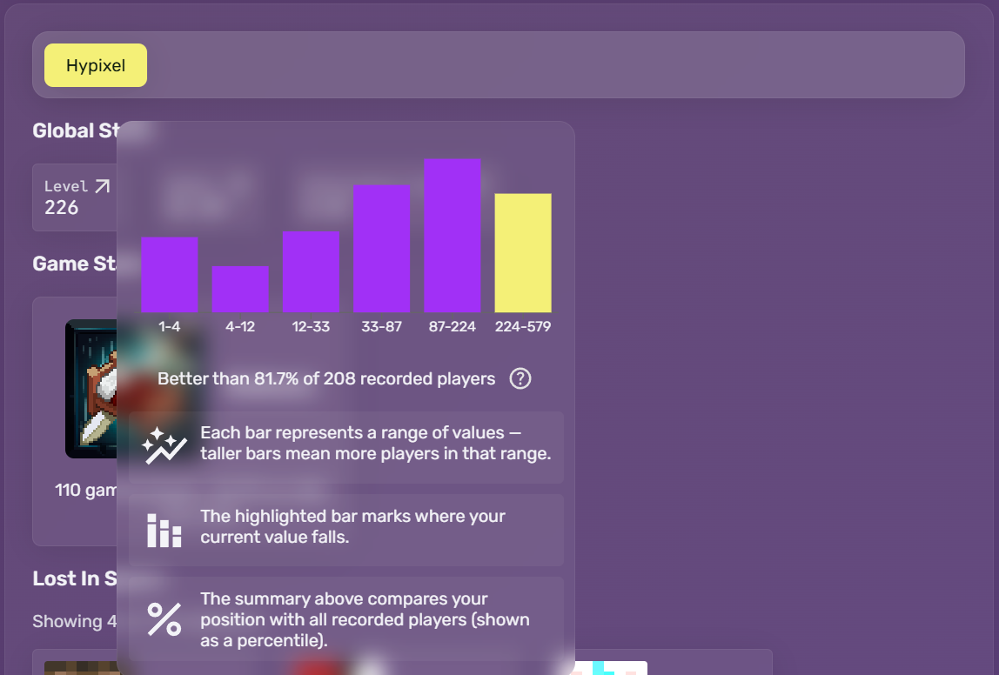

# Aspexis

A full‑stack Minecraft player lookup tool that
combines data from multiple servers into one clean interface.

**See it live at: [aspexis.netlify.app](https://aspexis.netlify.app/)**

## Features

🔎 Unified player stats from Hypixel, Wynncraft, MCC Island, and DonutSMP  
⚖️ Compare players' stats and see how they stack up across servers  
🎯 Live player status and activity tracking  
⭐ Save favorite players for quick access  
⚡ Fast responses with caching and an optimized backend

## Screenshots

### Player overview and stats

### Stat comparison

## How to use

1. Enter a Minecraft username or UUID
2. Instantly view stats across supported servers
3. Switch servers or compare players to explore detailed stats

## Tech stack

Frontend: React (TypeScript)  
Backend: FastAPI  
Database: PostgreSQL  
Caching: Redis  

Data sources: Mojang, Hypixel, Wynncraft, MCC Island,
DonutSMP, capes.me APIs  

Built as a personal project with a focus on performance,
clean UI, and real-time data aggregation.

## License

MIT