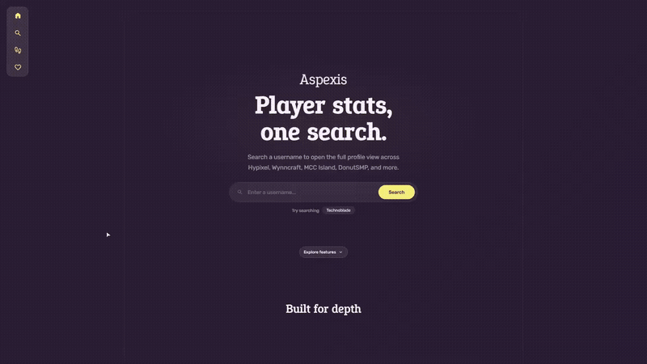
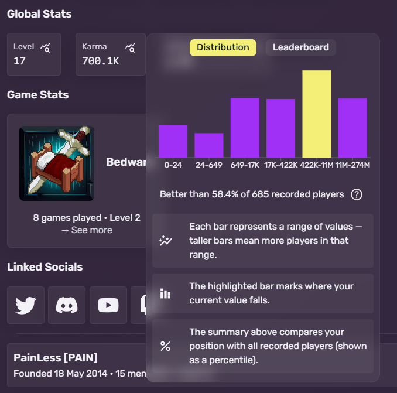
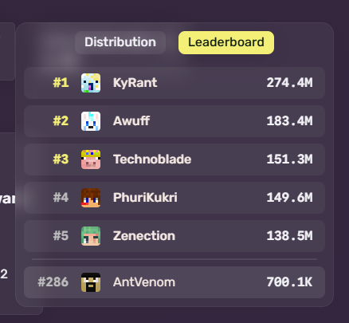
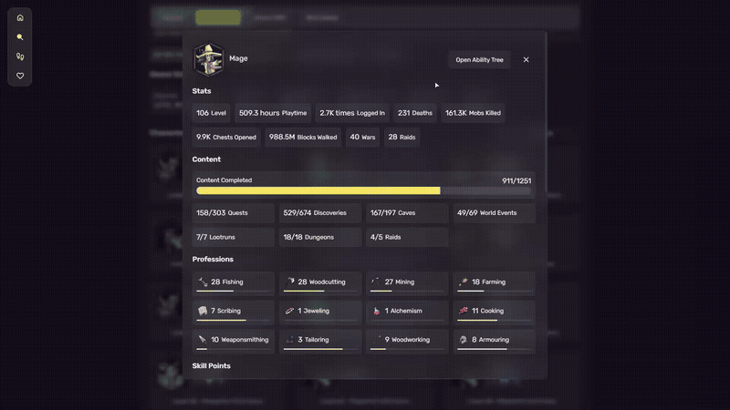

# Aspexis

Player stats, one search. Aspexis pulls Hypixel, Wynncraft, MCC Island, DonutSMP, and Mojang data into a single fast profile.

Try it here: **https://aspexis.netlify.app/**




## Features

- Search any player by username or UUID
- View Hypixel stats with Bedwars mode splits and full guild data
- Explore Wynncraft characters, completion progress, and an interactive ability tree
- See percentile rankings alongside raw stats
- Track player online/offline status in real time
- Favorite players for quick access later

## Stats and percentiles

Raw numbers don't mean much without context. When a player is looked up, their stats are recorded, building a pool of real player data over time. This powers distribution curves and percentile rankings, so instead of just seeing a raw score you can see how it compares to everyone else.

<table style="border: none;">
  <tr>
    <td></td>
    <td></td>
  </tr>
</table>


## Wynncraft integration

Wynncraft support goes deeper than a stat summary. Each player profile includes character listings with class icons, level data, and completion progress across quests, dungeons, and discoveries, calculated against live game-wide maximums so percentages are always accurate.

The standout feature is a fully interactive ability tree, browsable with hover tooltips, rich ability descriptions, and one-click PNG export.




## Tech stack

### Frontend

[](https://react.dev)
[](https://www.typescriptlang.org)
[](https://vite.dev)

### Backend

[](https://fastapi.tiangolo.com)
[](https://www.postgresql.org)
[](https://redis.io)


## Architecture

Aspexis uses a React/Vite frontend with a FastAPI backend. Redis handles caching and rate limiting. PostgreSQL stores player data accumulated from lookups, which powers the percentile and distribution features.

Provider failures are isolated, if one service is down or rate-limited, the rest of the profile still loads.

```text
React + Vite frontend
        │
        ▼
FastAPI backend
        │
        ├── Redis cache / rate limits
        ├── PostgreSQL player data / metrics
        │
        └── Mojang, Hypixel, Wynncraft, MCC Island, DonutSMP, capes.me
```

Want to run your own instance? See [self-hosting guide](self-hosting.md).

## License

MIT